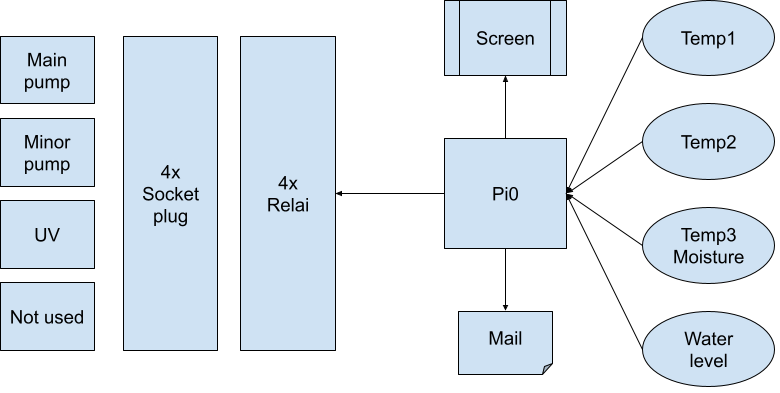

## The project

This project is a controller for pump and UV for a pond.
The PI0 will check the water level and cut off the pump if the level is low.

It is also possible to cut the UV or a pump for winter.

The PI is also connected to some temp sensor and displays information on a epaper screen.

Finally, if a camera is installed, pictures could be made of the pond or the filtration system for example and send via SFTP.

## basic schema

## Installation

Pip install pyyaml adafruit_dht 

## Contact
